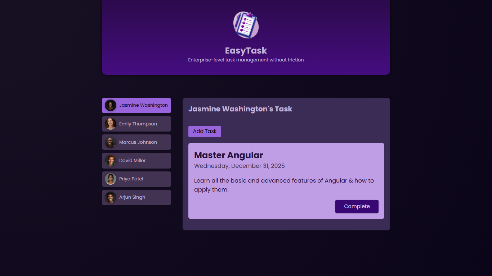

# EasyTask

## ✅ Angular Task Manager
A simple and lightweight task management app built using Angular. It allows you to add tasks associated with specific users, view all tasks, and mark tasks as complete. Tasks are saved in the browser’s LocalStorage, so your data is safe even after reloading the page or closing the browser.

## 🚀 Features
<!--   -->
🧾 Add Tasks with User Association
You can create new tasks by assigning them to any user.

📋 View All Tasks
Displays a list of all existing tasks along with the associated user.

✅ Mark Tasks as Complete
Marking a task as completed removes it from the list instantly.

 #### 💾 Persistent Storage (LocalStorage)

Tasks remain saved even after refreshing the page.

Closing and reopening the app won’t delete your data.

No backend or internet required — works entirely on the browser.

 
 
 
 
 
 
This project was generated using [Angular CLI](https://github.com/angular/angular-cli) version 19.2.15.
